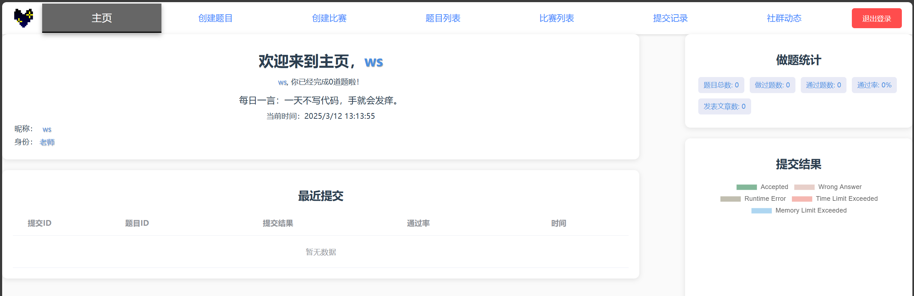
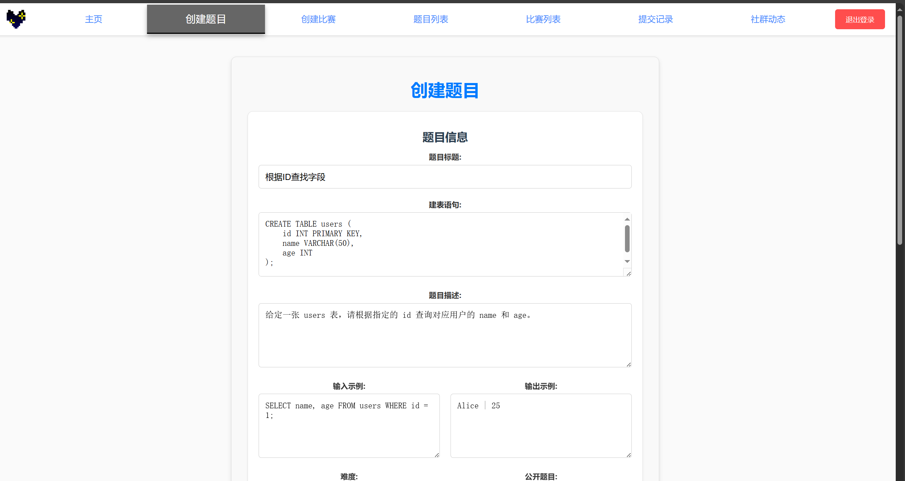
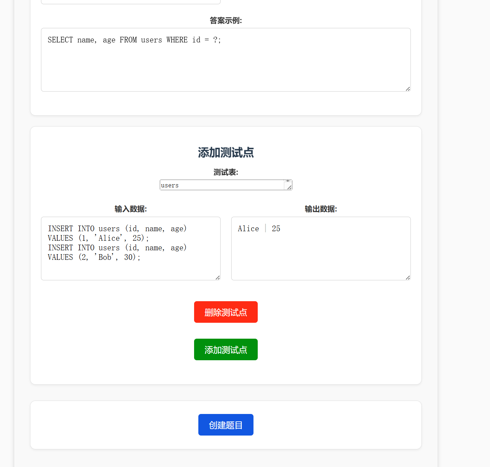
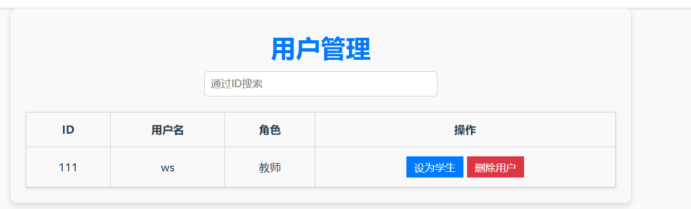

# Sql-Online-Judge

**An Online Judge platform based on the Vue framework, designed for the SQL language.**

**It is rich in functions, simple to use, accurate in judging, and fine in grading.**

## Platform Screenshots

<table>
  <tr>
    <td align="center">
      
       
      <b>初始登录界面</b>
    </td>
    <td align="center">
      
       
      <b>用户主页</b>
    </td>
  </tr>
  <tr>
    <td align="center">
      
       
      <b>题目列表</b>
    </td>
    <td align="center">
      
       
      <b>提交记录</b>
    </td>
  </tr>
  <tr>
    <td align="center">
      
       
      <b>创建题目（教师界面）</b>
    </td>
    <td align="center">
      
       
      <b>添加测试点（教师界面）</b>
    </td>
  </tr>
  <tr>
    <td align="center">
      
       
      <b>创建竞赛（教师界面）</b>
    </td>
    <td align="center">
      
       
      <b>用户权限管理（管理员界面）</b>
    </td>
  </tr>
  <tr>
    <td align="center">
      
       
      <b>博客社群</b>
    </td>
    <td align="center">
      
       
      <b>撰写博客</b>
    </td>
  </tr>
</table>

